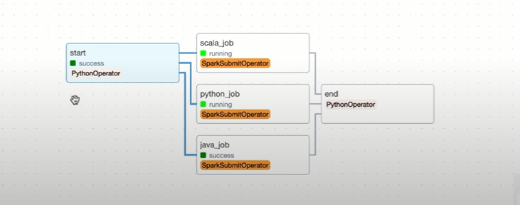

# 🚀 Apache Airflow with Multi-Language Spark Job Orchestration with Java, Scala and Python Spark Jobs

This project orchestrates Spark jobs written in **Python**, **Scala**, and **Java** using **Apache Airflow**, all within a **Dockerized environment**. The DAG `sparking_flow` submits Spark jobs in multiple languages to a local Spark cluster, enabling robust, scalable, and repeatable data workflows.

---

## 🔧 Technology Stack & Versions

| Tool        | Version       |
|-------------|---------------|
| Python      | 3.12.x        |
| Java        | 21 (LTS)      |
| Scala       | 3.4.x         |
| Apache Spark| 3.5.x         |
| Apache Airflow | 2.9.x      |
| SBT         | 1.10.x        |
| Docker      | Latest        |
| Docker Compose | Latest    |

---

## 📁 Project Structure

```bash
.
├── dags/
│   └── spark_airflow.py       # Airflow DAG
├── img/
│   └── Capture.PNG            # Airflow Graph
├── jobs/
│   ├── python/
│   │   └── wordcountjob.py    # Python Spark job
│   ├── scala/
│   │   ├── build.sbt
│   │   └── wordcountjob.scala # Scala Spark job
│   └── java/
│       └── spark-job/         # Java Spark job
│           └── src/...
├── airflow.env
├── docker-compose.yml
├── Dockerfile
└── .dockerignore
```

### 🚀 Apache Airflow Graph with Multi-Language Spark Job Orchestration




---

## ⚙️ Setup Instructions

### 🔨 Step 1: Initialize Directories and Files

```bash
mkdir dags jobs
touch airflow.env docker-compose.yml Dockerfile .dockerignore
mkdir -p jobs/python jobs/scala jobs/java
touch dags/spark_airflow.py
touch jobs/python/wordcountjob.py
touch jobs/scala/{build.sbt,wordcountjob.scala}
```

> *Optional:* Create the Java job under `jobs/java/spark-job/` following Maven or Gradle structure.

---

### 🐳 Step 2: Run the Docker Environment

```bash
docker compose up -d --build
```

To gracefully stop all running services:

```bash
docker compose down
```

To rebuild and restart the environment:

```bash
docker compose up -d --build
```

---

### 🌐 Access Web UIs

- **Airflow Web UI:** [http://localhost:8080](http://localhost:8080)  
  > Authenticate using your configured Airflow credentials (configured in the Airflow environment).

- **Spark Master UI:** [http://localhost:9090](http://localhost:9090)

---

## ⚡ Spark Cluster Configuration

A basic Spark setup includes **1 Master** and **1 Worker**.  
To scale up, **duplicate** the Spark Worker section in `docker-compose.yml`, assigning each container a unique name and hostname.

```yaml
spark-worker-2:
  image: bitnami/spark:latest
  container_name: spark-worker-2
  command: bin/spark-class org.apache.spark.deploy.worker.Worker spark://spark-master:7077
  depends_on:
    - spark-master
  environment:
    SPARK_MODE: worker
    SPARK_WORKER_CORES: 2
    SPARK_WORKER_MEMORY: 1g
    SPARK_MASTER_URL: spark://spark-master:7077
```

---

## 📦 Install Python & Airflow Dependencies

Inside your development environment or Docker container:

```bash
pip install apache-airflow apache-airflow-providers-apache-spark pyspark
```

---

## ✍️ DAG Creation

Create the DAG file at `dags/spark_airflow.py`, with tasks that trigger:

- A `PythonOperator` to mark the start
- A `SparkSubmitOperator` for:
  - Python job
  - Scala job
  - Java job
- A `PythonOperator` to mark the end

---

## 🐍 Python Spark Job

`jobs/python/wordcountjob.py`

```python
from pyspark.sql import SparkSession

spark = SparkSession.builder.appName("WordCountPython").getOrCreate()
data = spark.read.text("path/to/input.txt")
words = data.selectExpr("explode(split(value, ' ')) as word")
word_counts = words.groupBy("word").count()
word_counts.show()
spark.stop()
```

---

## 🧪 Scala Spark Job

Install Scala and SBT:

```bash
brew install scala sbt
```

`jobs/scala/wordcountjob.scala`

```scala
import org.apache.spark.sql.SparkSession

object WordCountScala {
  def main(args: Array[String]): Unit = {
    val spark = SparkSession.builder.appName("WordCountScala").getOrCreate()
    val data = spark.read.textFile("path/to/input.txt")
    val words = data.flatMap(_.split(" "))
    val wordCounts = words.groupByKey(identity).count()
    wordCounts.show()
    spark.stop()
  }
}
```

Compile and package:

```bash
cd jobs/scala
sbt compile
sbt package
```

---

## ☕ Java Spark Job

Follow Maven/Gradle layout. Sample logic should mirror the Scala/Python version.

```bash
mkdir -p jobs/java/spark-job/src/main/java/com/example
# Add Java class and pom.xml/build.gradle accordingly
```

Build the Java JAR:

```bash
cd jobs/java/spark-job
mvn clean package
```

---

## ✅ Airflow DAG Workflow

After successfully deploying the containers:

- Go to Airflow UI: `localhost:8080`
- Activate and manually trigger the DAG: `sparking_flow`

---

## 🔌 Notes

- You **must** configure the **Spark connection** in Airflow UI:
  - Go to **Admin > Connections > Add Connection**
  - Conn Type: `Spark`
  - Host: `spark://spark-master`
  - Port: `7077`

---

## 🎥 Full Tutorial

[](https://www.youtube.com/watch?v=o_pne3aLW2w)

---

## 🧼 Cleanup

```bash
docker compose down -v --remove-orphans
```

---

## 🧠 Contributions

We welcome contributions via pull requests. Please follow best practices and provide detailed descriptions when contributing.
